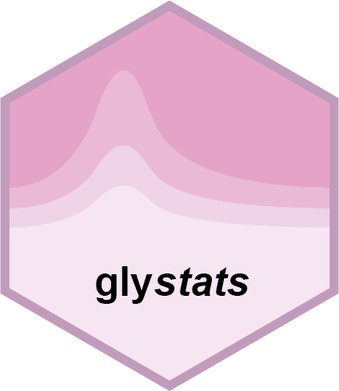

<!-- README.md is generated from README.Rmd. Please edit that file -->

```{r, include = FALSE}
knitr::opts_chunk$set(
  collapse = TRUE,
  comment = "#>",
  fig.path = "man/figures/README-",
  out.width = "100%"
)
```

# glystats <a href="https://glycoverse.github.io/glystats/"></a>


<!-- badges: start -->
[](https://lifecycle.r-lib.org/articles/stages.html#experimental)
[](https://CRAN.R-project.org/package=glystats)
[](https://github.com/glycoverse/glystats/actions/workflows/R-CMD-check.yaml)
[](https://app.codecov.io/gh/glycoverse/glystats)
<!-- badges: end -->

The goal of glystats is to perform statistical analysis on glycoproteomics and glycomics data.
It works seamlessly with the [glyexp](https://github.com/glycoverse/glyexp) package.

## Installation

You can install the development version of glystats from [GitHub](https://github.com/) with:

``` r
# install.packages("pak")
pak::pak("glycoverse/glystats")
```

## Documentation

- 📚 Reference: [Here](https://glycoverse.github.io/glystats/reference/index.html)

## Role in `glycoverse`

`glystats` is the downstream analysis package in the `glycoverse` ecosystem.
It provides statistical analysis functions for `glyexp::experiment()` objects.
A common workflow is to use [glyread](https://github.com/glycoverse/glyread) to import data,
[glyclean](https://github.com/glycoverse/glyclean) to preprocess data,
and then `glystats` to perform statistical analysis.

## Example

Say we already have a preprocessed experiment object called `exp`:

```r
# Two-sample t-test
ttest_res <- gly_ttest(exp)

# PCA analysis
pca_res <- gly_pca(exp)

# ROC analysis
roc_res <- gly_roc(exp)
```

That's it! These functions use `glycoverse` column conventions to load needed data and perform analysis.
All functions start with `gly_` to leverage the auto-completion in RStudio.
They accept an `glyexp::experiment()` object,
and return analysis result as a tibble or a list of tibbles.
See documentation for each function for more details.
